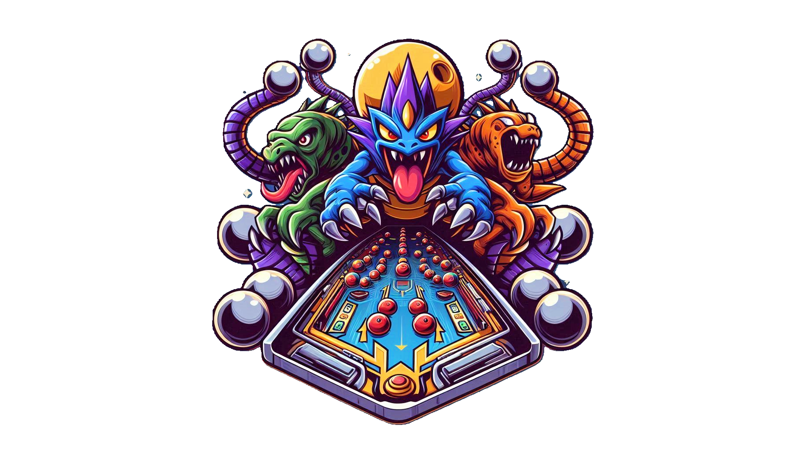

# Monster Pinball

Monster Pinball is an innovative mobile game that combines classic pinball mechanics with monster collecting, RPG elements, and themed environments. Navigate pinballs through various elemental realms, hatch unique monsters, and experience dynamic, evolving pinball tables!

## Requirements
Godot Engine v3.5.3.stable.official [6c814135b]

## 🎮 Features

- **Classic Pinball Mechanics**: Experience traditional flipper controls with a twist of elemental themes.
- **Monster Hatching**: Hit targets to spawn eggs, then hatch them to collect unique monsters.
- **Multiple Realms**: Explore different elemental tables, each with unique obstacles and challenges.
- **Monster Collection**: Gather and evolve over 100 unique monsters across various elemental types.
- **Dynamic Tables**: Watch as the pinball tables evolve based on your collected monsters and progression.

## 🚀 Current Development Stage: Beta

We're currently in the beta phase, focusing on core gameplay and essential features. Here's what's included in the beta:

- One fully functional pinball table (Enchanted Forest realm)
- 10 unique monsters (6 common, 3 uncommon, 1 rare)
- Basic monster abilities and Monsterpedia
- Core pinball mechanics and physics
- Monster hatching system
- Basic UI and scoring system

## 🔜 Upcoming Features

- Additional elemental realms
- Expanded monster roster and evolution system
- Multiplayer features and community events
- Advanced ball types and power-ups
- Monetization features

## 🛠️ Technical Requirements

- Platform: iOS/Android (Beta currently supports one mobile platform)
- Graphics: 2D with particle effects
- Local storage for monster collection and high scores

## 🧪 Testing Focus

We're currently seeking feedback on:
1. Core gameplay mechanics and physics
2. Monster hatching engagement
3. Overall game balance and difficulty
4. User interface and experience
5. Performance across various devices

## 📅 Roadmap

1. Beta testing and refinement
2. Implementation of additional realms
3. Expansion of monster roster and abilities
4. Introduction of multiplayer features
5. Full release across multiple mobile platforms
